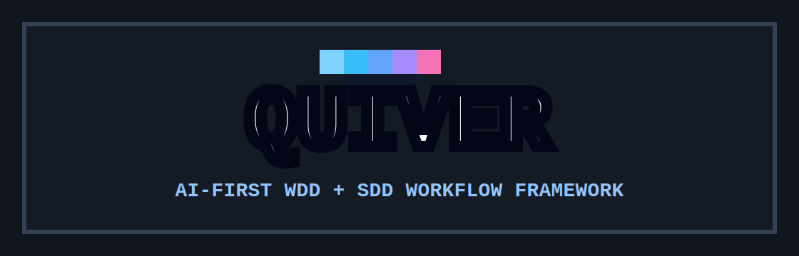
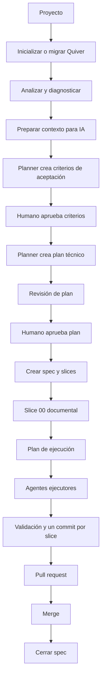

<p align="center">
  
</p>

<p align="center">
  <strong>Framework AI-first para ordenar trabajo con WDD + SDD</strong>
</p>

<p align="center">
  <a href="https://www.npmjs.com/package/create-quiver"></a>
  <a href="https://www.npmjs.com/package/create-quiver"></a>
  
  
  
</p>

<p align="center">
  <a href="#primeros-pasos">Primeros pasos</a> ·
  <a href="./docs/getting-started/installation.md">Instalación</a> ·
  <a href="./docs/workflows/existing-project.md">Proyecto existente</a> ·
  <a href="./docs/workflows/full-ai-spec-to-pr.md">Flujo completo</a> ·
  <a href="./docs/reference/commands.md">Comandos</a> ·
  <a href="./docs/CLI_UX_GUIDE.md">UX del CLI</a>
</p>

# Quiver

Quiver es un framework de workflow para proyectos de software que quieren usar agentes de IA sin convertir el repo en una bolsa de prompts, archivos sueltos y decisiones perdidas.

Ayuda a transformar requerimientos en criterios de aceptación, planes técnicos, specs, slices, handoffs, evidencia de validación, commits y pull requests.

La idea es simple: que la IA trabaje rápido, pero con orden.

En lugar de pedirle a un agente "hacé esto y vemos qué pasa", Quiver propone un camino repetible:

1. entender el repositorio;
2. preparar contexto del proyecto;
3. planificar con aprobaciones humanas;
4. generar specs y slices;
5. ejecutar un slice por vez;
6. validar con evidencia;
7. abrir un PR por slice por defecto.

## ¿Qué problema resuelve?

Los agentes de IA pueden acelerar mucho el desarrollo, pero suelen fallar por motivos bastante normales:

- leen demasiado contexto o leen el contexto incorrecto;
- implementan antes de cerrar criterios de aceptación;
- saltean la aprobación del plan;
- mezclan cambios no relacionados en el mismo PR;
- olvidan qué se aprobó en una fase anterior;
- generan código sin evidencia clara de validación;
- dejan al humano reconstruyendo qué pasó.

Quiver reduce ese desorden convirtiendo el trabajo asistido por IA en un flujo guiado, con archivos visibles y estados verificables.

## ¿Cómo funciona?

Quiver combina dos metodologías:

- **WDD**, Workflow-Driven Development: primero se define cómo se trabaja.
- **SDD**, Spec-Driven Development: el trabajo se describe como specs y slices antes de implementar.

En la práctica, Quiver separa planificación y ejecución:

- un **agente planificador** prepara criterios, plan técnico, spec, slices y cuerpo del PR;
- un **agente ejecutor** recibe solo el contexto mínimo de un slice y modifica código dentro del alcance aprobado;
- el humano aprueba las fases importantes antes de avanzar.



## Primeros pasos

Requisito runtime: Node.js `>=20.12.0`. Ese mínimo está declarado en `package.json` y coincide con las dependencias publicadas que usa el CLI.

Ejecutá Quiver desde la raíz del proyecto que querés preparar.

```bash
npx --yes create-quiver@latest init --name "Mi Proyecto"
npx --yes create-quiver@latest flow
npx --yes create-quiver@latest analyze
npx --yes create-quiver@latest doctor
```

Después prepará el contexto para IA:

```bash
npx --yes create-quiver@latest ai prepare-context --dry-run
npx --yes create-quiver@latest ai prepare-context
```

Ese flujo usa el modo determinístico de Quiver: analiza el proyecto y actualiza solo documentación de contexto sin llamar a un proveedor de IA. Si querés que un agente planificador proponga el contexto, usá el modo asistido:

```bash
npx --yes create-quiver@latest ai prepare-context --with-planner --dry-run
npx --yes create-quiver@latest ai prepare-context --with-planner --review --interactive
```

La inicialización crea un contrato visible para humanos y agentes, más estado interno de Quiver:

- `AGENTS.md`
- `docs/`
- `docs/AI_CONTEXT.md`
- `docs/AI_ONBOARDING_PROMPT.md`
- `docs/PROJECT_MAP.md`
- `.quiver/`
- scripts `quiver:*` en `package.json`

Las specs se crean después, cuando los criterios de aceptación y el plan técnico ya fueron aprobados.

## Uso con npx vs instalación local

El uso recomendado es ejecutar Quiver con `npx`:

```bash
npx --yes create-quiver@latest --help
```

Cuando usás `npx`, npm descarga y ejecuta el CLI desde su caché. Por eso Quiver puede funcionar aunque no aparezca dentro de `node_modules` del proyecto. Es esperado: `create-quiver` actúa como una herramienta de bootstrap y workflow, no como una dependencia runtime de tu app.

Si tu equipo quiere fijar una versión dentro del proyecto, podés instalarlo como dependencia de desarrollo:

```bash
npm install --save-dev create-quiver
npx create-quiver --help
```

La guía completa está en [Instalación y uso con npx](./docs/getting-started/installation.md).

## Elegí tu sistema operativo

Empezá por acá si estás configurando Quiver por primera vez en una máquina:

- [macOS](./docs/getting-started/macos.md)
- [Linux](./docs/getting-started/linux.md)
- [Windows PowerShell](./docs/getting-started/windows-powershell.md)
- [Windows Git Bash / WSL](./docs/getting-started/windows-git-bash-wsl.md)

## Elegí tu flujo

Usá la guía que corresponda al estado de tu proyecto:

- [Proyecto nuevo desde cero](./docs/workflows/new-project.md)
- [Proyecto existente sin Quiver](./docs/workflows/existing-project.md)
- [Proyecto existente con una versión vieja de Quiver](./docs/workflows/legacy-quiver-project.md)
- [Flujo completo con IA: requerimiento, spec, slices, commits y PR](./docs/workflows/full-ai-spec-to-pr.md)

## Comandos principales

| Comando | Qué hace |
|---|---|
| `npx --yes create-quiver@latest --help` | Muestra la lista pública de comandos. |
| `npx --yes create-quiver@latest --version` | Muestra la versión del CLI. |
| `npx --yes create-quiver@latest init --name "Proyecto"` | Inicializa Quiver en un proyecto. |
| `npx --yes create-quiver@latest init --interactive` | Abre una guía humana para elegir modo, metodología `wdd-sdd`, perfil inicial y próximos pasos de agentes. |
| `npx --yes create-quiver@latest migrate --dry-run` | Previsualiza la migración de un proyecto Quiver anterior. |
| `npx --yes create-quiver@latest analyze` | Genera el mapa del proyecto usado por humanos y agentes. |
| `npx --yes create-quiver@latest doctor` | Revisa si el contrato de Quiver está sano. |
| `npx --yes create-quiver@latest doctor --json` | Devuelve el diagnóstico como JSON para automatizaciones. |
| `npx --yes create-quiver@latest flow` | Indica el próximo paso seguro. |
| `npx --yes create-quiver@latest dashboard` | Muestra estado consolidado de specs, slices, runs, approvals y agentes sin escribir archivos. |
| `npx --yes create-quiver@latest ai prepare-context --dry-run` | Previsualiza contexto de onboarding para IA sin tocar código de producto. |
| `npx --yes create-quiver@latest ai prepare-context --with-planner --dry-run` | Previsualiza una propuesta de contexto generada por el planner. |
| `npx --yes create-quiver@latest ai models list` | Lista proveedores y modelos conocidos por Quiver para configurar agentes. |
| `npx --yes create-quiver@latest ai agent set planner --provider codex --model gpt-5.5 --dry-run` | Previsualiza un perfil de planner sin guardar credenciales ni escribir archivos. |
| `npx --yes create-quiver@latest ai agent doctor` | Diagnostica perfiles de agentes existentes. |
| `npx --yes create-quiver@latest ai agent repair --dry-run` | Previsualiza reparaciones seguras para perfiles heredados o mal configurados. |
| `npx --yes create-quiver@latest ai plan --phase acceptance` | Genera un borrador de criterios de aceptación. |
| `npx --yes create-quiver@latest ai approve --phase acceptance` | En TTY lista drafts y recomienda la versión current/latest aprobable. |
| `npx --yes create-quiver@latest ai plan --phase technical-plan` | Genera un borrador de plan técnico. |
| `npx --yes create-quiver@latest ai review-plan` | Revisa el plan técnico antes de aprobarlo. |
| `npx --yes create-quiver@latest ai approve --phase technical-plan` | En TTY muestra drafts con datos de review; en CI usá `--version <n>`. |
| `npx --yes create-quiver@latest spec create` | Crea spec, slices, briefs, plan de ejecución y cuerpo del PR. |
| `npx --yes create-quiver@latest spec create --interactive` | Guía la selección de metodología, input aprobado y revisión antes de escribir la spec. |
| `npx --yes create-quiver@latest spec start specs/<spec>` | Crea o reutiliza el worktree de una spec. |
| `npx --yes create-quiver@latest next --all-ready --spec <spec>` | Lista los slices listos para ejecutar. |
| `npx --yes create-quiver@latest ai execute-slice --slice <slice.json> --commit` | Ejecuta un slice aprobado y lo commitea después de validar. |
| `npx --yes create-quiver@latest ai pr --dry-run --input specs/<spec>/pr.md` | Previsualiza la creación del PR y el estado de GitHub. |
| `npx --yes create-quiver@latest spec close specs/<spec>` | Cierra el worktree de una spec ya mergeada. |

La referencia completa está en [docs/reference/commands.md](./docs/reference/commands.md).

## UX del CLI

Quiver usa un estándar único para que los comandos sean claros tanto para humanos como para automatizaciones:

- `--dry-run` muestra qué pasaría sin escribir ni ejecutar proveedores.
- `--print-prompt` imprime el prompt exacto y no ejecuta IA.
- `--with-planner` activa un modo asistido por planner solo en comandos que lo soportan.
- `--review` abre o prepara una revisión humana antes de escrituras persistentes.
- `--interactive` habilita confirmaciones explícitas cuando el comando puede cambiar estado.
- `--methodology wdd-sdd` declara la metodología soportada por los flujos guiados.
- `--json` mantiene salida legible por máquinas y no se combina con `--interactive` ni `--review`.
- `--no-color` desactiva colores cuando el entorno no los necesita.

El detalle del estándar, la matriz de comandos y los colores de Quiver están en [docs/CLI_UX_GUIDE.md](./docs/CLI_UX_GUIDE.md).

## ¿Qué crea Quiver?

Quiver deja visible la documentación útil del proyecto y guarda su estado interno en `.quiver/`.

| Ruta | Para qué sirve |
|---|---|
| `AGENTS.md` | Punto de entrada para agentes de IA. |
| `docs/AI_CONTEXT.md` | Contexto compacto del proyecto para agentes. |
| `docs/AI_ONBOARDING_PROMPT.md` | Prompt que un agente puede ejecutar para hacer onboarding seguro. |
| `docs/PROJECT_MAP.md` | Stack, package manager, scripts y datos del proyecto. |
| `docs/WORKFLOW.md` | Contrato local de trabajo. |
| `specs/<spec>/SPEC.md` | Spec aprobada. |
| `specs/<spec>/slices/<slice>/slice.json` | Contrato del slice: alcance, dependencias y validación. |
| `EXECUTION_BRIEF.md` | Lo que necesita saber el agente ejecutor. |
| `CLOSURE_BRIEF.md` | Qué se hizo, qué se validó y qué quedó pendiente. |
| `.quiver/` | Estado interno: runs, approvals, scans, snapshots y agentes. |

## Para agentes de IA

Los comandos pensados para agentes deberían usar una versión explícita y modo no interactivo:

```bash
npx --yes create-quiver@latest ai prompt-slice --slice specs/<spec>/slices/<slice>/slice.json --dry-run
```

Quiver puede trabajar con CLIs locales de proveedores como:

- `codex`
- `claude`
- `gemini`

Las credenciales las manejan esos CLIs. Quiver no guarda API keys en los perfiles de agentes.

Los perfiles de agentes separan dos datos:

- `model`: identificador técnico que Quiver pasa al CLI del proveedor, por ejemplo `gpt-5.5`.
- `displayName`: nombre humano que Quiver muestra en selectores y reportes, por ejemplo `GPT 5.5`.

`ai models list` muestra modelos conocidos por Quiver. Eso no garantiza que el proveedor o tu cuenta tengan acceso a todos esos modelos. Para revisar configuraciones existentes, usá `ai agent doctor`; para perfiles viejos con alias visuales guardados como modelo técnico, empezá con `ai agent repair --dry-run`.

## Requisitos

- Node.js y npm.
- Git.
- `gh` para crear pull requests en GitHub.
- Un CLI local de proveedor si querés que Quiver invoque IA directamente.

El CLI está pensado para macOS, Linux, Windows PowerShell, Git Bash y WSL.
En Windows PowerShell usá el CLI Node o los scripts `quiver:*` generados, por
ejemplo `npm run quiver:check-slice -- --local specs/<spec>/slices/<slice>/slice.json`.
Los scripts Bash legacy, como `start:slice` o `check:slice`, se conservan solo
para compatibilidad en shells con Bash.

## Desarrollar Quiver

```bash
git clone <repo-url>
cd quiver
npm install
node bin/create-quiver.js --help
node --test tests/**/*.test.js
npm run package:quiver
```

Validación de release:

```bash
npm run smoke:create-quiver
npm run smoke:doctor-fixtures
npm run smoke:guided-workflow
npm run smoke:tiered-pack
npm run package:quiver
npm pack --dry-run
```

## Documentación

- [Flujo completo](./docs/workflows/full-ai-spec-to-pr.md)
- [Guía para proyectos existentes](./docs/workflows/existing-project.md)
- [Referencia de comandos](./docs/reference/commands.md)
- [Guía de UX del CLI](./docs/CLI_UX_GUIDE.md)
- [Troubleshooting template](./docs/TROUBLESHOOTING.md.template)
- [Guía de IA de este repositorio](./README_FOR_AI.md)
- [Changelog](./CHANGELOG.md)
- [Roadmap](./ROADMAP.md)

## Licencia

MIT
