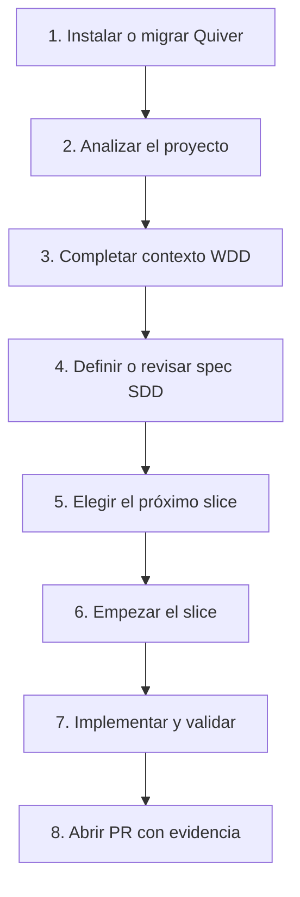

# Quiver

Quiver es una herramienta de línea de comandos para ordenar proyectos que trabajan con documentación, especificaciones, slices y ayuda de agentes de IA.

Su objetivo es simple: que una persona o un agente puedan llegar a un repo, entender qué está pasando, elegir el próximo trabajo correcto y avanzar sin romper el flujo del equipo.

## Quickstart AI-first

Si venís a usar Quiver con agentes de IA, el camino recomendado es: un agente planner entiende el proyecto y arma el plan; después uno o más agentes executor trabajan slice por slice con contexto mínimo.

1. Prepará el contexto del repo.

```bash
npx create-quiver analyze
npx create-quiver doctor
```

2. Hacé onboarding del planner sin gastar tokens todavía.

```bash
npx create-quiver ai onboard --dry-run
```

3. Planificá por fases y aprobá cada salida antes de avanzar.

```bash
npx create-quiver ai plan --phase acceptance --input requirements.md --dry-run
npx create-quiver ai plan --phase technical-plan --input acceptance-approved.md --dry-run
npx create-quiver ai plan --phase spec --input technical-plan-approved.md --dry-run
```

4. Ejecutá un slice con un agente executor.

```bash
npx create-quiver ai execute-slice --slice specs/<project-slug>/slices/slice-01/slice.json --dry-run
```

5. Validá el preflight del PR.

```bash
npx create-quiver ai pr --dry-run --ssh-host-alias github-work --identity-file ~/.ssh/github-work
```

El `--dry-run` muestra provider, rol, contexto e invocación sin llamar al modelo. Cuando el plan esté revisado, podés quitarlo y usar el provider local configurado: `codex`, `claude` o `gemini`.

## ¿Qué es Quiver?

Quiver es un workflow AI-first de documentación para proyectos de software.

Sirve para preparar un proyecto antes de implementar: crea una estructura de documentos, comandos y convenciones para que el trabajo no dependa de memoria, chats perdidos o instrucciones sueltas.

Ayuda a:

- desarrolladores que quieren trabajar por piezas pequeñas y revisables;
- equipos que usan IA para analizar, planificar o implementar;
- maintainers que necesitan que cada cambio tenga contexto, alcance y evidencia;
- agentes de IA que necesitan saber por dónde empezar sin leer todo el repo.

Quiver existe porque el caos también compila. A veces. Pero después alguien tiene que entenderlo.

## ¿Qué problema resuelve?

En muchos proyectos, el trabajo empieza con una pregunta sencilla: "¿por dónde arranco?"

El problema es que la respuesta suele estar repartida en demasiados lugares:

- un README que no está actualizado;
- tickets con contexto incompleto;
- decisiones tomadas en conversaciones;
- comandos que solo una persona conoce;
- agentes de IA leyendo archivos de más o tocando archivos de menos;
- PRs grandes donde es difícil saber qué se intentó hacer.

Quiver busca reducir esa fricción. No intenta reemplazar al equipo ni decidir por él. Lo que hace es ordenar el terreno para que el siguiente paso sea claro.

## ¿Cómo lo resuelve?

Quiver agrega una estructura de trabajo al proyecto.

Esa estructura separa tres cosas que suelen mezclarse:

- **Contexto:** qué es el proyecto, cómo se trabaja y qué comandos existen.
- **Plan:** qué problema se quiere resolver y en qué partes se divide.
- **Ejecución:** qué slice se está trabajando, qué archivos puede tocar y cómo se valida.

Cuando participa IA, Quiver también separa roles:

- **Planner:** agente que lee más contexto, propone criterios, plan técnico, specs, slices y cuerpo de PR.
- **Executor:** agente que recibe un slice aprobado, modifica código dentro del alcance declarado y valida la salida.

Al inicializarse, Quiver genera documentos y comandos para que el proyecto tenga un contrato de trabajo repetible.

Los conceptos principales son:

- **Spec:** documento que describe un objetivo de trabajo. Define el problema, alcance, estado y evidencia esperada.
- **Slice:** parte pequeña de una spec. Un slice debe ser lo bastante acotado como para implementarse, validarse y revisarse sin mezclar temas.
- **Project map:** resumen generado por Quiver con stack, package manager, comandos y pistas del repo. Vive en `docs/PROJECT_MAP.md`.
- **AI context:** paquete de contexto para agentes de IA. Vive en `docs/AI_CONTEXT.md`.
- **Handoff:** documento excepcional para transferir contexto entre agentes o fases. Vive en `specs/<spec-slug>/HANDOFF.md`.

La regla práctica es: primero contexto, después plan, después código.

## Primeros pasos

Quiver se usa desde la raíz del proyecto donde querés instalar el workflow. No se recomienda instalarlo globalmente. Usá `npx create-quiver` o, si el equipo necesita fijar versión, una dev dependency local.

### Caso 1: Proyecto nuevo desde cero

Usá este camino cuando estás empezando un proyecto y querés sumar Quiver desde el principio.

1. Creá o entrá a la carpeta del proyecto.

```bash
mkdir mi-proyecto
cd mi-proyecto
```

2. Inicializá Quiver con el nombre del proyecto.

```bash
npx create-quiver --name "Mi Proyecto"
```

Esto crea la estructura base de documentación y workflow. Después de inicializar, Quiver intenta instalarse como dev dependency del proyecto para que los comandos futuros resuelvan a la versión local.

3. Analizá el proyecto.

```bash
npx create-quiver analyze
```

Esto genera `docs/PROJECT_SCAN.json` y `docs/PROJECT_MAP.md`. Esos archivos ayudan a humanos y agentes a entender el repo sin adivinar.

4. Validá el contrato generado.

```bash
npx create-quiver doctor
```

El doctor revisa si falta algo importante y muestra los próximos pasos recomendados.

5. Leé el onboarding para agentes antes de pedir implementación.

```text
Lee `docs/AI_ONBOARDING_PROMPT.md` y ejecútalo como fuente principal de verdad para incorporarte a este repositorio.

Actúa como asistente de onboarding de IA. Prepara el contexto del proyecto para trabajar de forma segura con el workflow documentado, specs y slices.

No modifiques código de producto salvo autorización explícita. Puedes crear o actualizar documentación de contexto si el onboarding lo requiere.

Usa solo la documentación del repositorio como fuente de verdad. Si encuentras información faltante, ambigua o contradictoria, documenta el supuesto, el riesgo y continúa por el camino más seguro.

Responde en español y finaliza con un reporte breve de archivos leídos, archivos modificados, estado del código de producto, supuestos, riesgos y próximos pasos.
```

Resultado esperado: el proyecto queda con `docs/`, `specs/<project-slug>/`, scripts `quiver:*` en `package.json`, archivos de soporte y una primera base para planificar trabajo.

### Caso 2: Proyecto ya comenzado

Usá este camino cuando el proyecto ya existe, pero nunca fue inicializado con Quiver.

1. Revisá el estado actual antes de tocar nada.

```bash
git status --short
```

Si hay cambios pendientes, conviene commitearlos, guardarlos o crear una rama dedicada para incorporar Quiver. La idea es que el diff de onboarding sea fácil de revisar.

2. Inicializá Quiver desde la raíz del proyecto.

```bash
npx create-quiver --name "Nombre del Proyecto"
```

No uses `migrate` si el proyecto nunca tuvo Quiver. `migrate` es solo para proyectos ya inicializados por una versión anterior.

3. Analizá el repo real.

```bash
npx create-quiver analyze
```

Esto detecta stack, package manager, comandos y archivos relevantes.

4. Corré el doctor.

```bash
npx create-quiver doctor
```

El doctor indica si falta completar contexto, si conviene revisar el onboarding de IA o si hay pasos pendientes.

5. Revisá el diff antes de seguir.

```bash
git status --short
```

Resultado esperado: Quiver agrega o actualiza archivos de workflow y documentación. No debería ser el momento de cambiar código de producto; primero se estabiliza el contexto.

### Caso 3: Proyecto ya comenzado con una versión vieja de Quiver

Usá este camino cuando el proyecto ya tiene archivos de Quiver, pero pueden estar desactualizados.

1. Buscá señales de una instalación previa.

Revisá si existen archivos como:

- `.quiver/state.json`
- `docs/AI_CONTEXT.md`
- `docs/PROJECT_MAP.md`
- `docs-template/`
- `tools/scripts/`
- scripts `quiver:*` en `package.json`

2. Ejecutá el doctor para conocer el estado.

```bash
npx create-quiver doctor
```

Si el proyecto necesita migración, el doctor debería indicarlo.

3. Migrá solo si el proyecto ya había sido inicializado por Quiver.

```bash
npx create-quiver migrate
```

La migración actualiza el contrato de Quiver y agrega scripts o archivos faltantes de forma aditiva. Si estás en CI, offline o no querés instalar dependencias durante la migración, podés usar:

```bash
npx create-quiver migrate --skip-install
```

4. Volvé a analizar y validar.

```bash
npx create-quiver analyze
npx create-quiver doctor
```

5. Revisá el diff antes de continuar con slices.

```bash
git status --short
```

Resultado esperado: el proyecto queda alineado con el contrato actual de Quiver sin mezclar migración con implementación de producto.

## Flujo de trabajo recomendado con WDD y SDD

El repositorio no define formalmente las siglas WDD y SDD como comandos propios. En esta guía las usamos para nombrar dos prácticas que Quiver ya promueve:

- **WDD, Workflow-Driven Development:** primero se documenta cómo se trabaja. El workflow, comandos, contexto y reglas quedan escritos antes de pedir cambios de producto.
- **SDD, Spec-Driven Development:** el trabajo se define en specs y slices antes de implementar. La spec explica el objetivo; el slice limita el alcance.



### 1. Instalar o migrar Quiver

Usá `npx create-quiver --name "Proyecto"` para proyectos nuevos o nunca inicializados. Usá `npx create-quiver migrate` solo cuando el proyecto ya tenía Quiver.

### 2. Analizar el proyecto

Ejecutá:

```bash
npx create-quiver analyze
```

El resultado importante es `docs/PROJECT_MAP.md`, que debe tratarse como fuente de verdad para stack, package manager, comandos y pistas de archivos.

### 3. Completar contexto WDD

Antes de implementar, revisá y completá la documentación de contexto:

- `AGENTS.md`
- `docs/AI_CONTEXT.md`
- `docs/AI_ONBOARDING_PROMPT.md`
- `docs/CONTEXTO.md`
- `docs/WORKFLOW.md`
- `docs/STATUS.md`
- `docs/DECISIONS.md`

Si un agente de IA participa, primero debe preparar contexto y reportar supuestos. No debería tocar código de producto sin autorización explícita.

### 4. Definir o revisar spec SDD

Trabajá sobre `specs/<project-slug>/SPEC.md`.

La spec debe explicar:

- qué problema se quiere resolver;
- qué entra y qué queda afuera;
- qué evidencia va a demostrar que el trabajo terminó;
- cómo se divide en slices.

### 5. Elegir el próximo slice

Usá los comandos de orquestación:

```bash
npx create-quiver plan
npx create-quiver graph
npx create-quiver next
```

`plan` muestra el orden sugerido. `graph` muestra dependencias. `next` señala el próximo slice listo.

Si el trabajo va a pasar por IA, usá los comandos `ai` en fases y siempre revisá primero con `--dry-run`:

```bash
npx create-quiver ai onboard --dry-run
npx create-quiver ai plan --phase acceptance --input requirements.md --dry-run
npx create-quiver ai plan --phase technical-plan --input acceptance-approved.md --dry-run
npx create-quiver ai plan --phase spec --input technical-plan-approved.md --dry-run
```

El planner prepara onboarding, criterios, plan técnico y artefactos. El executor trabaja después, con el contexto mínimo de un slice aprobado.

### 6. Empezar el slice

Cuando el slice esté definido:

```bash
npx create-quiver start-slice specs/<project-slug>/slices/slice-01/slice.json
```

Cada spec vuelve a empezar en `slice-01`. El número del slice es local a esa spec, no global del repo.

### 7. Implementar y validar

Durante la implementación, leé primero el `slice.json`, los archivos declarados, pruebas cercanas y código directamente relacionado.

Validá el slice y el PR:

```bash
npx create-quiver check-slice specs/<project-slug>/slices/slice-01/slice.json
npx create-quiver check-pr specs/<project-slug>/slices/slice-01/slice.json
```

Si querés validar que los archivos tocados respetan el alcance declarado:

```bash
npx create-quiver check-scope specs/<project-slug>/slices/slice-01/slice.json
```

### 8. Abrir PR con evidencia

La regla del workflow es:

- un slice = un commit;
- una spec = un PR;
- cada PR debe incluir evidencia de validación;
- las decisiones durables van en `docs/DECISIONS.md`;
- los aprendizajes reutilizables pueden registrarse en `docs/ai/LESSONS.md`.

## Comandos disponibles

Los comandos principales se ejecutan con `npx create-quiver ...`. En proyectos generados, también quedan disponibles scripts `npm run quiver:*` que llaman al CLI Node.

### Inicialización y mantenimiento del workflow

| Comando | Para qué sirve | Cuándo usarlo |
|---|---|---|
| `npx create-quiver --name "Proyecto"` | Inicializa Quiver en el proyecto actual. | Proyecto nuevo o proyecto existente que nunca tuvo Quiver. |
| `npx create-quiver --name "Proyecto" --dir ./ruta` | Inicializa o inspecciona otra carpeta explícitamente. | Cuando no estás parado en la raíz del proyecto destino. |
| `npx create-quiver migrate` | Actualiza una instalación previa de Quiver. | Solo en proyectos que ya fueron inicializados por Quiver. |
| `npx create-quiver migrate --skip-install` | Migra sin instalar `create-quiver` como dev dependency. | CI, entornos offline o migraciones donde no querés tocar dependencias. |
| `npx create-quiver doctor` | Valida el contrato generado y muestra pasos siguientes. | Después de init, migrate o analyze. |

### Análisis y contexto

| Comando | Para qué sirve | Resultado esperado |
|---|---|---|
| `npx create-quiver analyze` | Escanea el proyecto y genera contexto técnico. | `docs/PROJECT_SCAN.json` y `docs/PROJECT_MAP.md`. |
| `npx create-quiver check-handoff specs/<spec-slug>/HANDOFF.md` | Valida que un handoff exista en la ubicación correcta y tenga secciones requeridas. | Confirmación o errores accionables. |
| `npx create-quiver new-handoff <spec-slug>` | Crea un `HANDOFF.md` para una transferencia excepcional. | `specs/<spec-slug>/HANDOFF.md`. |

### Planificación y orquestación de slices

| Comando | Para qué sirve | Flags útiles |
|---|---|---|
| `npx create-quiver plan` | Lista slices pendientes en orden de ejecución y calcula camino crítico. | `--json`, `--only-ready`, `--spec <slug>` |
| `npx create-quiver graph` | Muestra el grafo de dependencias entre slices. | `--format mermaid`, `--format dot`, `--show-conflicts`, `--level <n>` |
| `npx create-quiver next` | Muestra el próximo slice listo para trabajar. | `--all-ready`, `--json`, `--auto-start` |

### Orquestación con IA

| Comando | Para qué sirve | Notas |
|---|---|---|
| `npx create-quiver ai onboard` | Arma el prompt de onboarding para un agente planner. | Usá `--dry-run` para revisar provider, rol y contexto sin ejecutar el modelo. |
| `npx create-quiver ai plan --phase acceptance --input requirements.md` | Pide criterios de aceptación desde un requerimiento. | No crea specs ni modifica código. |
| `npx create-quiver ai plan --phase technical-plan --input acceptance-approved.md` | Pide plan técnico desde criterios aprobados. | Mantiene la fase en modo planificación. |
| `npx create-quiver ai plan --phase spec --input technical-plan-approved.md` | Genera `SPEC.md`, slices, handoffs, `EXECUTION_PLAN.md` y `pr.md`. | Requiere aprobación previa del plan técnico. |
| `npx create-quiver ai execute-slice --slice <slice.json>` | Ejecuta un slice con rol executor y valida scope post-run. | Requiere worktree limpio y falla si toca archivos fuera de `slice.json.files`. |
| `npx create-quiver ai doctor --dry-run --ssh-host-alias <alias> --identity-file <path>` | Valida preflight de GitHub/SSH sin crear PR. | Revisa `gh`, auth, remote, rama, worktree, guía GitFlow e identity file. |
| `npx create-quiver ai pr --dry-run --ssh-host-alias <alias> --identity-file <path>` | Prepara validaciones del flujo PR. | En esta versión no abre PR real; dry-run no crea nada. |

Providers soportados: `codex`, `claude` y `gemini`, siempre vía CLI local. Quiver arma la invocación con argumentos separados y transporta prompts largos sin concatenarlos en un shell string.

### Ejecución y validación

| Comando | Para qué sirve | Cuándo usarlo |
|---|---|---|
| `npx create-quiver start-slice <slice.json>` | Prepara el trabajo de un slice. | Al comenzar una unidad de trabajo. |
| `npx create-quiver start-slice --allow-draft <slice.json>` | Permite iniciar un slice en estado draft intencionalmente. | Solo cuando el equipo decide trabajar sobre un draft. |
| `npx create-quiver check-slice <slice.json>` | Valida readiness del slice. | Antes o durante la ejecución. |
| `npx create-quiver check-slice --gate validation <slice.json>` | Valida el slice en modo cierre. | Antes de marcarlo como completado. |
| `npx create-quiver check-pr <slice.json>` | Valida que el PR tenga la estructura esperada. | Antes de abrir o pedir review. |
| `npx create-quiver check-scope <slice.json>` | Revisa que los archivos tocados estén dentro del alcance declarado. | Antes de cerrar el slice. |
| `npx create-quiver cleanup-slice <slice.json>` | Limpia estado local asociado a un slice. | Al terminar o descartar trabajo local. |
| `npx create-quiver refresh-active-slices` | Regenera el tablero local de slices activos. | Cuando querés ver o refrescar actividad local. |

### Scripts npm generados

Después de inicializar o migrar, los proyectos quedan con scripts equivalentes:

```bash
npm run quiver:analyze
npm run quiver:plan
npm run quiver:graph
npm run quiver:next
npm run quiver:doctor
npm run quiver:ai:onboard -- --dry-run
npm run quiver:ai:plan -- --phase acceptance --input requirements.md --dry-run
npm run quiver:ai:execute-slice -- --slice specs/<project-slug>/slices/slice-01/slice.json --dry-run
npm run quiver:ai:doctor -- --dry-run --ssh-host-alias github-work --identity-file ~/.ssh/github-work
npm run quiver:ai:pr -- --dry-run --ssh-host-alias github-work --identity-file ~/.ssh/github-work
npm run quiver:migrate
npm run quiver:start-slice -- specs/<project-slug>/slices/slice-01/slice.json
npm run quiver:check-slice -- specs/<project-slug>/slices/slice-01/slice.json
npm run quiver:check-pr -- specs/<project-slug>/slices/slice-01/slice.json
npm run quiver:check-handoff -- specs/<project-slug>/HANDOFF.md
npm run quiver:cleanup-slice -- specs/<project-slug>/slices/slice-01/slice.json
npm run quiver:check-scope -- specs/<project-slug>/slices/slice-01/slice.json
npm run quiver:refresh-active-slices
```

Los wrappers Bash en `tools/scripts/` existen por compatibilidad en proyectos generados. Para automatización nueva, preferí `npx create-quiver ...` o los scripts `quiver:*`.

## Qué genera Quiver

Según el estado del proyecto y el modo usado, Quiver puede generar o actualizar:

- `AGENTS.md`
- `docs/`
- `docs/ai/`
- `docs/AI_CONTEXT.md`
- `docs/AI_ONBOARDING_PROMPT.md`
- `docs/PROJECT_SCAN.json`
- `docs/PROJECT_MAP.md`
- `docs/DECISIONS.md`
- `docs/COMMANDS.md`
- `specs/<project-slug>/`
- `specs/<project-slug>/HANDOFF.md`
- `tools/scripts/`
- `.github/`
- scripts `quiver:*` en `package.json`

No todos los proyectos necesitan todos los archivos opcionales. Si un archivo no existe, no lo des por hecho: crealo desde la plantilla o registrá que falta.

## Requisitos

- Node.js y npm para ejecutar el instalador.
- Git para branches, worktrees y validaciones de PR.
- macOS, Linux o Windows PowerShell/CMD como entornos objetivo del runtime Node.

Bash queda como camino de compatibilidad legacy para algunos wrappers. El contrato de largo plazo es Node-first.

## Para agentes de IA

Si estás trabajando como agente dentro de este repo, leé primero `README_FOR_AI.md`.

Si estás trabajando en un proyecto generado con Quiver, el orden recomendado es:

1. `AGENTS.md`
2. `docs/PROJECT_MAP.md`
3. `docs/PROJECT_SCAN.json`
4. `docs/AI_CONTEXT.md`
5. `docs/AI_ONBOARDING_PROMPT.md`

Para implementar, no abras todo el repo por costumbre. Empezá por el `slice.json`, los archivos declarados, pruebas cercanas y código directamente relacionado.

## Para maintainers de Quiver

Comandos útiles para preparar releases del paquete:

```bash
npm whoami
npm view create-quiver version
npm run package:quiver
npm run smoke:create-quiver
npm run release:quiver
```

Publicar la versión actual:

```bash
bash scripts/release-quiver.sh --publish-current
```

Publicar con bump de versión:

```bash
bash scripts/release-quiver.sh patch --publish
```

Si `npm whoami` o `npm view create-quiver version` falla, primero resolvé autenticación o conectividad con npm.

## Referencias

- [Guía para IA](./README_FOR_AI.md)
- [Changelog](./CHANGELOG.md)
- [Roadmap](./ROADMAP.md)
- [Backlog](./BACKLOG.md)
- [Template customization](./TEMPLATE.md)
- [Contributing](./CONTRIBUTING.md)
- [Security](./SECURITY.md)

## Licencia

MIT
