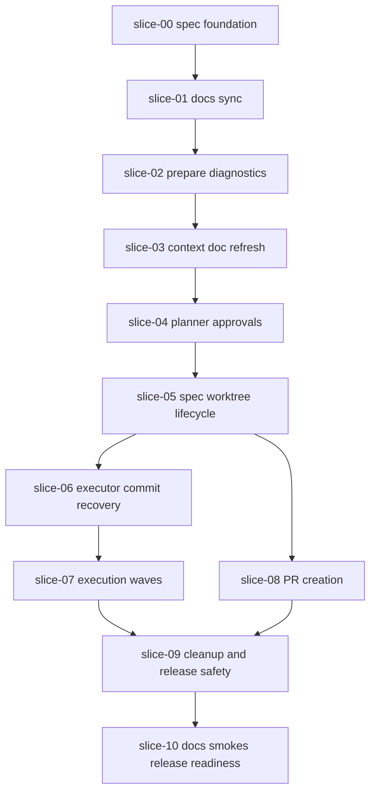

# Execution Plan - Quiver v22 Guided AI Workflow

## Rule

`slice-00` is mandatory and must be committed first. It establishes the spec foundation in the repo.

## Recommended Wave Plan

This is the safe default plan. It optimizes for low merge risk and production-readiness over speed.

| Wave | Mode | Slices | Why |
|------|------|--------|-----|
| 0 | Sequential | `slice-00-spec-foundation` | Publishes the spec foundation, handoffs, execution plan, and PR body. Nothing else should start before this commit exists. |
| 1 | Sequential | `slice-01-docs-source-of-truth-sync` | Fixes current documentation drift so later agents read reliable guidance. |
| 2 | Sequential | `slice-02-prepare-command-diagnostics` | Adds the safe project preparation entrypoint used by later workflow steps. |
| 3 | Sequential | `slice-03-context-doc-refresh` | Improves AI context generation after the preparation command exists. |
| 4 | Sequential | `slice-04-planner-approval-state` | Adds persisted approvals; spec/worktree automation should not run before approved inputs are traceable. |
| 5 | Sequential | `slice-05-spec-worktree-lifecycle` | Establishes one spec per worktree before executor, PR, and cleanup automation. |
| 6 | Sequential | `slice-06-executor-commit-recovery` | Makes single-slice execution safe and recoverable before multi-slice execution. |
| 7 | Sequential | `slice-07-execution-waves-delegation` | Builds on the executor to coordinate waves and delegation. |
| 8 | Sequential | `slice-08-pr-create-gh-ssh` | Adds PR creation after command-router changes from execution slices are stable. |
| 9 | Sequential | `slice-09-post-merge-cleanup-release-safety` | Requires execution-wave and PR behavior to be known. |
| 10 | Sequential | `slice-10-docs-smokes-release-readiness` | Final docs and smokes must run last. |

## Parallelization Assessment

No slice should run in parallel before `slice-05`.

After `slice-05`, `slice-06-executor-commit-recovery` and `slice-08-pr-create-gh-ssh` are conceptually independent, but the declared file scopes overlap in command-router files such as `src/create-quiver/commands/ai.js`. Because of that, the default recommendation is sequential execution.

Parallel execution is allowed only if the executor changes are split so file ownership is disjoint:

| Optional Wave | Mode | Slices | Condition |
|---------------|------|--------|-----------|
| 6A | Parallel | `slice-06-executor-commit-recovery` + `slice-08-pr-create-gh-ssh` | Only if one slice owns executor internals and the other owns PR internals without both editing the same command-router files. |
| 6B | Sequential integration | Router wiring or conflict resolution | Required if 6A was used and both features need command registration. |
| 7 | Sequential | `slice-07-execution-waves-delegation` | Starts only after executor behavior from `slice-06` is integrated. |

If the file scopes are not split before execution, do not use the optional parallel wave.

## Dependency Graph

## Suggested Commit Order

1. `docs(spec): add guided ai workflow spec foundation`
2. `docs(ai): sync source of truth for guided workflow`
3. `feat(cli): add guided prepare diagnostics`
4. `feat(analyze): refresh ai context docs safely`
5. `feat(ai): persist planner approvals`
6. `feat(spec): manage spec worktree lifecycle`
7. `feat(ai): commit validated executor slices`
8. `feat(ai): execute slices by safe waves`
9. `feat(ai): create prs with gh and ssh guidance`
10. `feat(spec): close merged specs and guard releases`
11. `docs(ai): document guided workflow and add smokes`

## Executor Assignment

Recommended executor model:

- Use the planner agent for `slice-00`, high-level review, and final integration checks.
- Use cheaper executor agents for `slice-01` through `slice-08` only after the owning slice and file scope are clear.
- Keep `slice-09` with a stronger reviewer because it includes cleanup and release-safety behavior.
- Keep `slice-10` with the planner or a docs/test-focused executor because it validates the full user-facing story.

## Integration Notes

- Do not start implementation slices before `slice-00` is committed.
- Do not enable parallel execution before file-scope conflict checks exist.
- If two slices declare the same source file, execute them sequentially or split ownership before delegation.
- Keep provider and `gh` tests mocked.
- Treat real provider CLIs as optional manual checks.
- Keep one spec PR branch/worktree for final integration.
