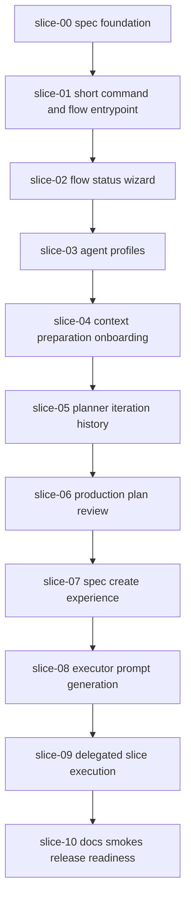

# Execution Plan - Quiver v23 Guided Flow Productization

## Rule

`slice-00` is mandatory and must be committed first. It establishes the spec foundation in the repo.

## Recommended Wave Plan

This is the safe default plan. It favors reliable integration over speed because several slices will touch command routing, docs, and shared AI workflow state.

| Wave | Mode | Slices | Why |
|------|------|--------|-----|
| 0 | Sequential | `slice-00-spec-foundation` | Publishes the spec foundation, handoffs, execution plan, and PR body. |
| 1 | Sequential | `slice-01-short-command-and-flow-entrypoint` | Establishes the command surface before adding higher-level flow behavior. |
| 2 | Sequential | `slice-02-flow-status-wizard` | Adds the next-step guide that later slices can extend. |
| 3 | Sequential | `slice-03-agent-profiles` | Adds planner/executor/reviewer profile state before using those profiles in prompts. |
| 4 | Sequential | `slice-04-context-preparation-onboarding` | Productizes onboarding prompts after profiles and flow status exist. |
| 5 | Sequential | `slice-05-planner-iteration-history` | Adds versioned drafts and approvals before plan review and spec creation. |
| 6 | Sequential | `slice-06-production-plan-review` | Adds the production-readiness review gate before spec generation. |
| 7 | Sequential | `slice-07-spec-create-experience` | Builds on approved and reviewed plans to create specs predictably. |
| 8 | Sequential | `slice-08-executor-prompt-generation` | Generates minimal manual executor prompts after spec/slice shape is stable. |
| 9 | Sequential | `slice-09-delegated-slice-execution` | Adds the highest-risk delegated execution behavior after all prerequisites exist. |
| 10 | Sequential | `slice-10-docs-smokes-release-readiness` | Final docs and smokes must run last. |

## Parallelization Assessment

Default recommendation: execute sequentially.

Optional parallel work is possible only after `slice-03` if file ownership is split:

| Optional Wave | Mode | Slices | Condition |
|---------------|------|--------|-----------|
| 4A | Parallel | `slice-04-context-preparation-onboarding` + `slice-05-planner-iteration-history` | Only if command routing changes are isolated and shared state files are not edited by both slices. |
| 8A | Parallel | `slice-08-executor-prompt-generation` + docs draft work for `slice-10` | Only if docs work does not depend on final delegated behavior. |

If file scopes overlap or are unknown, fall back to sequential execution.

## Dependency Graph

## Suggested Commit Order

1. `docs(spec): add guided flow productization spec`
2. `feat(cli): add quiver flow entrypoint`
3. `feat(flow): show next safe workflow step`
4. `feat(ai): persist agent profiles`
5. `feat(ai): productize context onboarding`
6. `feat(ai): version planner drafts and approvals`
7. `feat(ai): review technical plans for production readiness`
8. `feat(spec): create specs from reviewed approved plans`
9. `feat(ai): generate minimal executor prompts`
10. `feat(ai): delegate slice execution safely`
11. `docs(ai): document guided flow and add smokes`

## Executor Assignment

- Keep `slice-00`, `slice-01`, `slice-02`, `slice-06`, `slice-09`, and `slice-10` with a stronger planner/reviewer because they affect user flow, safety, or integration.
- `slice-03`, `slice-04`, `slice-05`, `slice-07`, and `slice-08` can be executed by cheaper code-focused agents if their file scopes are clear.
- Do not delegate parallel slices unless write sets are disjoint.

## Integration Notes

- Do not start implementation slices before `slice-00` is committed.
- Keep provider calls mocked in automated tests.
- Keep real provider CLI checks manual or dry-run only.
- Preserve existing `npx create-quiver` commands.
- Treat `quiver` as an alias unless a deliberate package decision changes that.
