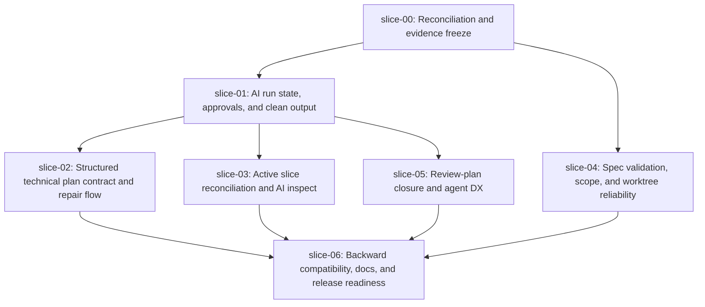

# Execution Plan - Quiver v28 Pixel Quiver Feedback Reconciliation

## Execution Order

## Waves

### Wave 0 - Sequential

1. `slice-00-reconciliation-and-evidence-freeze`

This slice must run first. It decides what is already resolved, what is pending, and what must not be reimplemented.

### Wave 1 - Parallel after slice-00

- `slice-01-ai-run-state-approvals-and-clean-output`
- `slice-04-spec-validation-scope-and-worktree-reliability`

These can run in parallel because their primary write scopes are different.

### Wave 2 - Parallel after slice-01

- `slice-02-structured-technical-plan-contract-and-repair-flow`
- `slice-03-active-slice-reconciliation-and-ai-inspect`
- `slice-05-review-plan-closure-and-agent-dx`

These depend on the run/approval model being clarified.

### Wave 3 - Sequential close

1. `slice-06-backward-compatibility-docs-and-release-readiness`

This slice must run last because it validates compatibility, docs, package smoke, and final coverage.

## Parallel Safety Notes

- Do not run slices in parallel if `slice-00` finds that their write scopes overlap more than currently expected.
- `slice-02` and `slice-05` may both touch planning prompts; if `slice-00` identifies overlap, run `slice-02` before `slice-05`.
- `slice-06` is never parallel-safe.

