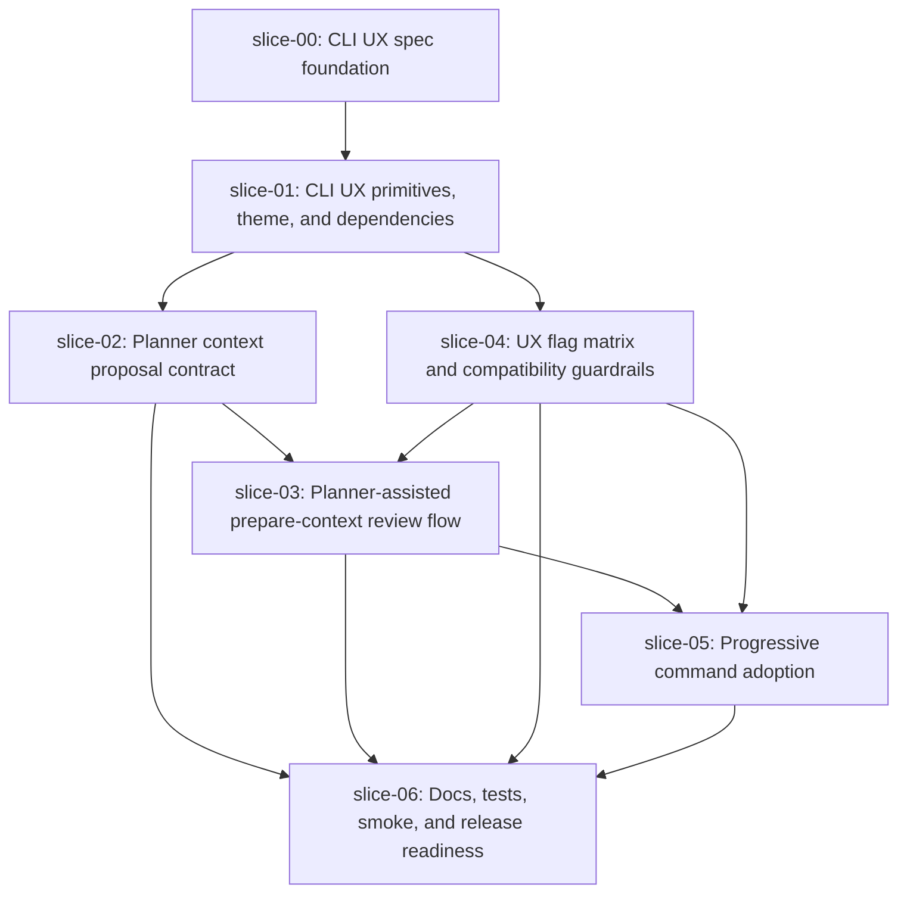

# Execution Plan - Quiver v29 Planner Prepare Context CLI UX

## Execution Order

## Waves

### Wave 0 - Sequential

1. `slice-00-cli-ux-spec-foundation`

This slice must run first. It establishes the approved UX standard, command/flag matrix, and documentation contract.

### Wave 1 - Sequential

1. `slice-01-cli-ux-primitives-theme`

This slice adds shared UX infrastructure and dependencies. Other implementation slices depend on this common layer.

### Wave 2 - Parallel after slice-01

- `slice-02-planner-context-proposal-contract`
- `slice-04-ux-flag-matrix-compatibility`

These can run in parallel if their write scopes stay separated: proposal validation under AI libs, flag/output guardrails under CLI parsing and UX helpers.

### Wave 3 - Sequential

1. `slice-03-prepare-context-planner-review-flow`

This slice depends on the proposal contract and UX compatibility rules.

### Wave 4 - Sequential

1. `slice-05-progressive-command-adoption`

This slice applies the standard to selected commands after `ai prepare-context` proves the pattern.

### Wave 5 - Sequential close

1. `slice-06-docs-tests-smoke-readiness`

This slice closes docs, generated templates, validation coverage, package smoke, and release readiness.

## Parallel Safety Notes

- Do not run `slice-03` before `slice-02` and `slice-04` are complete.
- Do not run `slice-05` before `slice-03`; progressive adoption should reuse the proven prepare-context pattern.
- `slice-06` is never parallel-safe because it validates all previous slices and updates final documentation.
- If `slice-02` or `slice-04` both need to modify central CLI parsing, run `slice-04` first, then rebase `slice-02`.
