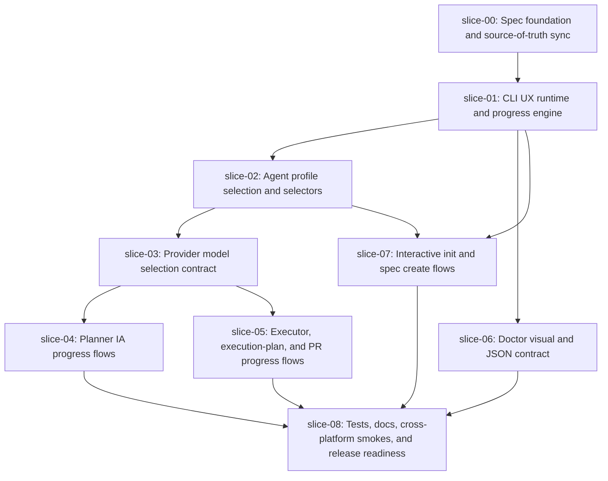

# Execution Plan - Quiver v30 Interactive CLI UX and Agent Selection

## Execution Order

## Waves

### Wave 0 - Sequential

1. `slice-00-spec-foundation`

This slice must run first. It commits the approved spec, all slices, handoffs, execution plan, PR body, and source-of-truth documentation sync.

### Wave 1 - Sequential

1. `slice-01-cli-ux-runtime-progress-engine`

Shared UX runtime and progress lifecycle must exist before command adoption.

### Wave 2 - Sequential Core Selection

1. `slice-02-agent-profile-selection-selectors`
2. `slice-03-provider-model-selection-contract`

Profile selectors must land before provider model execution semantics so selected models and display names map to real provider invocations.

### Wave 3 - Parallel after slice-03

- `slice-04-planner-ia-progress-flows`
- `slice-05-executor-pr-progress-flows`
- `slice-06-doctor-visual-json-contract`
- `slice-07-interactive-init-spec-create`

These can run in parallel if their write scopes stay separated. Resolve conflicts in `src/create-quiver/commands/ai.js` by landing planner flows before executor/PR flows if needed.

### Wave 4 - Sequential Close

1. `slice-08-tests-docs-cross-platform-release`

This slice validates all previous work, updates final docs/templates, and prepares package release evidence.

## Parallel Safety Notes

- Do not run any implementation slice before `slice-00`.
- Do not adopt command progress before `slice-01`.
- Do not show profile/model display names in live IA flows before `slice-03` proves selected models map to real provider invocations.
- `slice-04` and `slice-05` may both touch `commands/ai.js`; if conflicts are likely, run `slice-04` first.
- `slice-08` is never parallel-safe because it closes docs, tests, smokes, and release readiness.

## Recommended Commit Order

1. `docs: add v30 interactive cli ux spec`
2. `feat: add cli ux progress runtime`
3. `feat: add agent profile selectors`
4. `feat: add provider model selection contract`
5. `feat: add planner progress flows`
6. `feat: add executor and pr progress flows`
7. `feat: add doctor visual json contract`
8. `feat: add interactive init and spec create`
9. `docs: close v30 cli ux release readiness`
