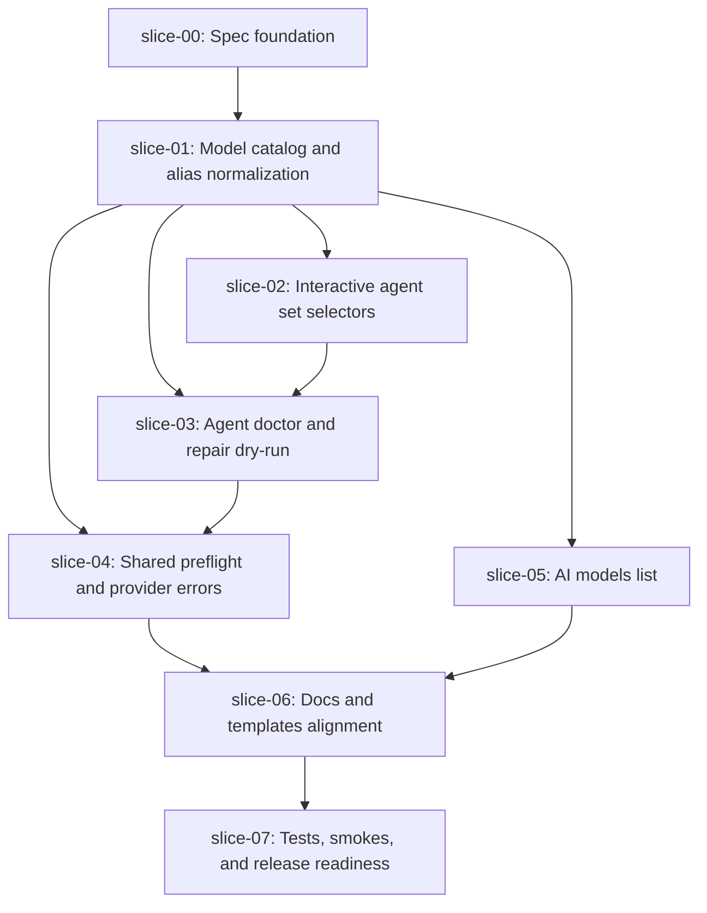

# Execution Plan - Quiver v31 AI Model Catalog and Agent Selection

## Execution Order

## Waves

### Wave 0 - Sequential

1. `slice-00-spec-foundation`

This slice must run first. It commits the approved spec, every slice, handoffs, execution plan, PR body, and source-of-truth documentation sync.

### Wave 1 - Sequential Core

1. `slice-01-model-catalog-alias-normalization`

The catalog and model-resolution contract must exist before selectors, doctor, repair, or live command preflight can use it.

### Wave 2 - Parallel after slice-01

- `slice-02-interactive-agent-set-selectors`
- `slice-05-ai-models-list`

These can run in parallel if their write scopes stay separated.

### Wave 3 - Sequential Diagnostics and Runtime

1. `slice-03-agent-doctor-repair`
2. `slice-04-shared-preflight-provider-errors`

Doctor/repair should land before command preflight so existing-profile diagnostics and preflight reuse the same issue classification.

### Wave 4 - Sequential Docs

1. `slice-06-docs-templates-alignment`

Docs depend on the final command names and output contracts.

### Wave 5 - Sequential Close

1. `slice-07-tests-smokes-release-readiness`

Final validation is never parallel-safe.

## Parallel Safety Notes

- Do not run any implementation slice before `slice-00`.
- Do not implement selectors before catalog helpers exist.
- Do not add live command preflight before doctor/repair issue classification is stable.
- `slice-02` and `slice-05` may both touch `commands/ai.js`; if conflicts are likely, run `slice-02` first.
- `slice-07` must close the spec after all other slices.

## Recommended Commit Order

1. `docs: add v31 ai model catalog spec`
2. `feat: add ai model catalog normalization`
3. `feat: add interactive agent model selectors`
4. `feat: add agent profile doctor repair`
5. `feat: add ai model preflight errors`
6. `feat: add ai models list`
7. `docs: document ai model catalog setup`
8. `docs: close v31 model catalog release readiness`
