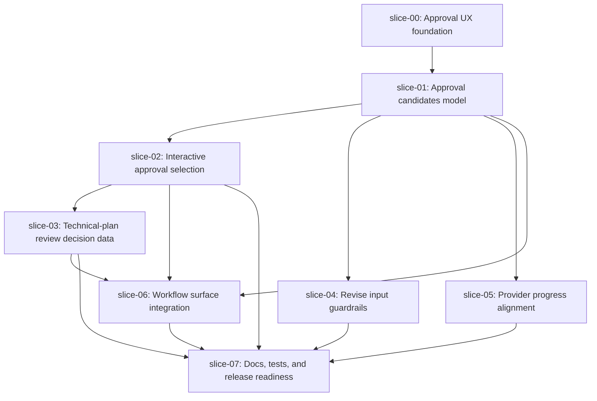

# Execution Plan - Quiver v33 Approval UX and Planner Progress

## Execution Order

## Waves

### Wave 0 - Completed Foundation

1. `slice-00-approval-ux-foundation`

The foundation slice creates the approved spec package and does not change product code.

### Wave 1 - Core Model

1. `slice-01-approval-candidates-model`

Build the shared approval-candidate model before changing command UX.

### Wave 2 - Command UX and Guardrails

1. `slice-02-approve-interactive-selection`
2. `slice-04-revise-input-guardrails`
3. `slice-05-provider-progress-alignment`

These slices can proceed after slice-01. Coordinate conflicts in `src/create-quiver/commands/ai.js`.

### Wave 3 - Technical Review and Workflow Surfaces

1. `slice-03-technical-plan-review-decision-data`
2. `slice-06-workflow-surface-integration`

Run slice-03 before or alongside slice-06 only if the plan-review decision contract is stable enough to consume.

### Wave 4 - Close

1. `slice-07-docs-tests-release-readiness`

This slice is never parallel-safe because it closes docs, tests, smokes, and release evidence.

## Parallel Safety Notes

- Do not run any implementation slice before slice-01.
- Do not add `ai approve` prompts before the shared candidate model exists.
- Do not weaken `plan-review` blocking behavior while adding selectors.
- `slice-02`, `slice-04`, and `slice-05` may all touch `src/create-quiver/commands/ai.js`; if conflicts are likely, land them sequentially.
- Keep all JSON/no-TTY behavior clean at every slice, not only at the final slice.

## Recommended Commit Order

1. `docs: add v33 approval ux spec`
2. `feat: add approval candidate model`
3. `feat: add interactive approval selection`
4. `feat: expose technical plan review decision data`
5. `fix: harden ai revise input handling`
6. `feat: align planner progress flows`
7. `feat: share approval guidance across workflow surfaces`
8. `docs: close v33 approval ux readiness`
