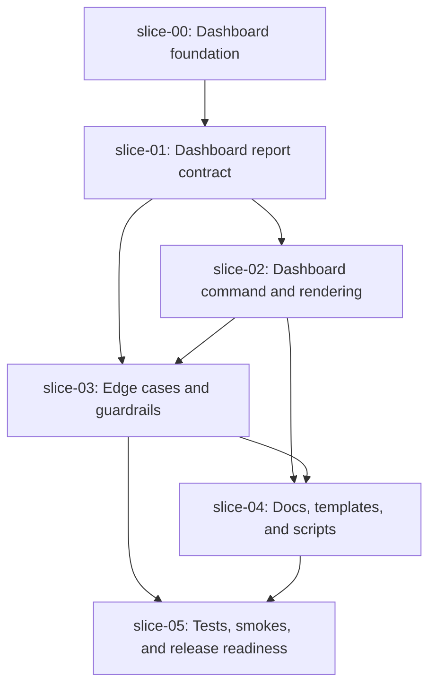

# Execution Plan - Quiver v34 CLI Dashboard Status

## Execution Order

## Waves

### Wave 0 - Foundation

1. `slice-00-dashboard-foundation`

This slice publishes the approved spec package and does not change product code.

### Wave 1 - Report Contract

1. `slice-01-dashboard-report-contract`

Build the dashboard data contract before adding a public command.

### Wave 2 - Public Command

1. `slice-02-dashboard-command-rendering`

Expose the report through `npx create-quiver dashboard` with human and JSON output.

### Wave 3 - Hardening

1. `slice-03-dashboard-edge-cases-and-guardrails`

Harden missing specs, graph failures, layout states, no-spec projects, blockers, no-color/CI/no-TTY, and sensitive summaries after the command path exists.

### Wave 4 - Docs

1. `slice-04-docs-templates-and-scripts`

Document the command and generated `quiver:dashboard` script after the command contract stabilizes.

### Wave 5 - Close

1. `slice-05-tests-smokes-release-readiness`

Run full validation, update evidence, close slice metadata, and prepare the PR body.

## Parallel Safety Notes

- Do not implement `slice-02` before `slice-01`; the command must consume a stable report contract.
- `slice-03` should follow `slice-02` so guardrails can test both model and command behavior.
- `slice-04` should wait until command flags and output shape are stable.
- `slice-05` is never parallel-safe because it closes docs, evidence, smokes, and readiness state.
- Keep JSON cleanliness validated at every implementation slice, not only at final release readiness.

## Recommended Commit Order

1. `docs: add v34 cli dashboard spec`
2. `feat: add dashboard report contract`
3. `feat: add dashboard command rendering`
4. `fix: harden dashboard edge cases`
5. `docs: document dashboard command`
6. `test: close dashboard release readiness`
