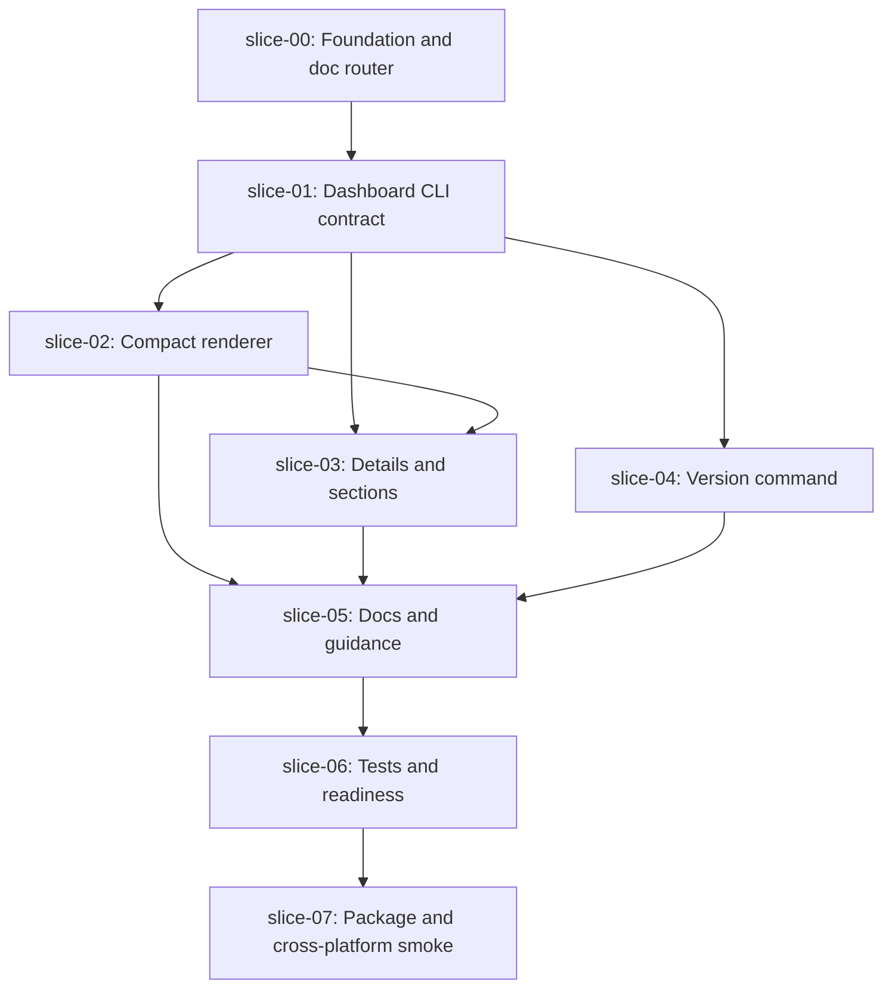

# Execution Plan - Quiver v35 Compact Dashboard and Version UX

## Execution Order

## Waves

### Wave 0 - Foundation

1. `slice-00-foundation-and-doc-router`

Creates the approved spec package only. No product code changes.

### Wave 1 - Public Contract

1. `slice-01-dashboard-cli-contract`

Defines dashboard flags, invalid combinations, JSON-safe errors, and parser/routing behavior before render changes.

### Wave 2 - Human UX

1. `slice-02-dashboard-compact-renderer`
2. `slice-04-version-command`

These can run after `slice-01` if the implementers coordinate shared CLI theme/router changes.

### Wave 3 - Deep Inspection

1. `slice-03-dashboard-details-sections`

Depends on the compact renderer and CLI contract so section output does not fork semantics.

### Wave 4 - Docs

1. `slice-05-docs-help-generated-guidance`

Runs after command behavior stabilizes.

### Wave 5 - Validation

1. `slice-06-tests-smokes-release-readiness`
2. `slice-07-package-and-cross-platform-smoke`

`slice-07` closes package-installed and cross-platform validation after focused tests and docs are stable.

## Parallel Safety Notes

- `slice-01` is not parallel-safe because it defines parser and command contracts.
- `slice-02` and `slice-04` may run in parallel only after `slice-01`, because one touches dashboard rendering and the other touches version output.
- `slice-03` waits for `slice-02` so detail/section renderers share formatting primitives.
- `slice-05` waits for behavior to stabilize.
- `slice-06` and `slice-07` are closeout-oriented and should not be over-parallelized.

## Recommended Commit Order

1. `docs: add v35 compact dashboard and version ux spec`
2. `feat: add dashboard view flags contract`
3. `feat: compact dashboard human output`
4. `feat: add dashboard detail and section views`
5. `feat: add quiver version command`
6. `docs: document dashboard and version ux`
7. `test: validate compact dashboard and version ux`
8. `test: validate package-installed cli ux`
